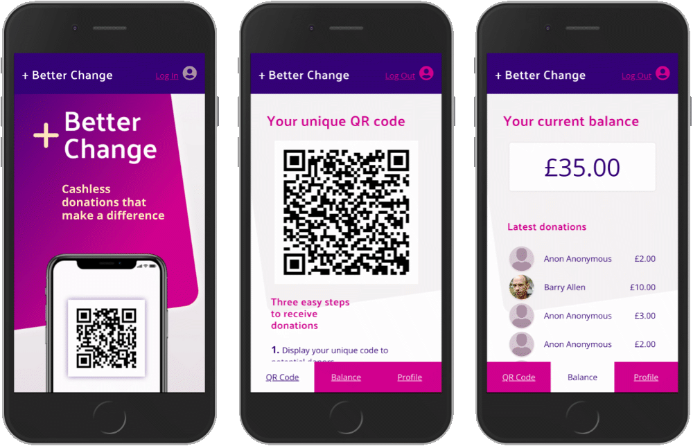

# Better Change
## In person cashless donations.
## Enabling contactless charity donations without a card reader

> [Visit live demo](http://www.betterchange.net)

--- 

### The vision

+ We live in an increasingly cashless society. Fewer people carry loose change.
+ Card readers cost £25–100 each and are expensive to distribute and manage.
+ Charity fundraisers and others who rely on cash donations are losing out.
+ **Better Change** solves this problem by enabling people to receive contactless payments without a card reader.

### Installation and set up
Clone the project and run `npm install`

Create your own local PostreSQL database instance and create the tables by running `pgweb` navigating to localhost:8081 and running the query in the database.sql file.

Create a `.env` file with the following variables
```
DB_HOST=localhost
DB_NAME=
DB_USERNAME=
DB_PASSWORD=
TWILIO_SID_TEST=
TWILIO_AUTH_TEST=
TWILIO_SID_LIVE=
TWILIO_AUTH_LIVE=
S3_REGION=
S3_BUCKET=
S3_ACCESS_KEY_ID=
S3_SECRET_ACCESS_KEY=
STRIPE_SECRET_KEY=
```
Run `npm start` to launch the app and navigate to localhost:8080

API Keys needed:

+ Amazon S3
+ Stripe
+ Twilio

---

### Tech stack

#### Front end
 - React
 - Redux
 - React Router
 - Handlebars
 - SCSS

#### Back end
- Node.js
- Express
- PostreSQL

#### Build tools
- Webpack
- Babel

#### Unit Testing
- Jest
- Enzyme
---

### Features

#### QR code 
- 'qrcode' node package creates the QR code dynamically
- The QR code isn't reliant on a 3rd party API
- The QR code size, style and error correction level are customisable
> ['qrcode' node package](https://www.npmjs.com/package/qrcode)

#### Card and native payment - Stripe elements
- Stripe Elements API provides our secure hosting
> ['Stripe elements' node package](https://stripe.com/payments/elements)

#### Image hosting - Amazon S3
- We used the AWS-SDK node package to host images
- Enabled us to upload / download images to an S3 bucket
> [Aws-sdk node package](https://www.npmjs.com/package/aws-sdk)

#### Form validation - Formik
- Formik node package managed the form validation
- Solved the problem of getting values in and out of form state
- Streamlined handling error messages and form submission
> [Formik node package](https://www.npmjs.com/package/formik)

#### Data visulisations - Recharts.js
> ['Recharts' node package](http://recharts.org/en-US/)

#### Authorisation and authentication - Passport

#### Next Steps
- Create React Native app
- Emit bluetooth urls
- Pay out to bank accounts

QR codes are not always the best solution for in person payment because they require you to be in close proximity to capture with a camera.

We have started playing around with Bluetooth beacons and have used an android phone to emit our unique payment urls for people to pick up in the immediate area.
